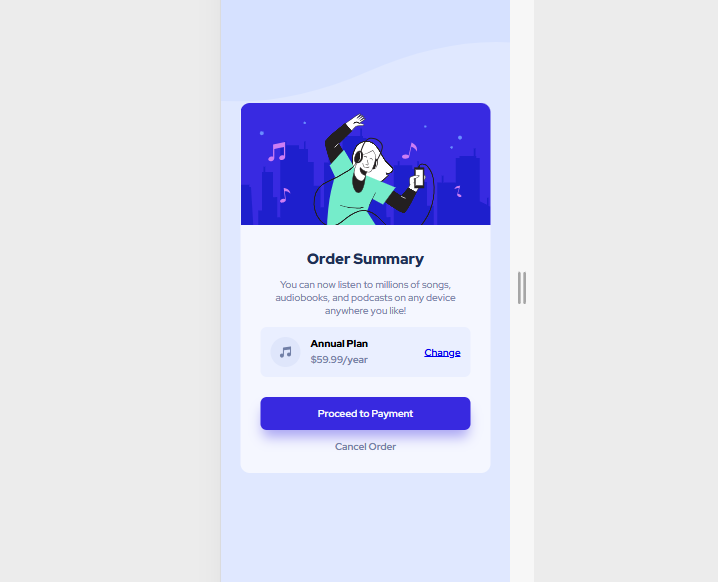

# Frontend Mentor - Order summary card solution

This is a solution to the [Order summary card challenge on Frontend Mentor](https://www.frontendmentor.io/challenges/order-summary-component-QlPmajDUj). Frontend Mentor challenges help you improve your coding skills by building realistic projects. 

## Table of contents

- [Overview](#overview)
  - [The challenge](#the-challenge)
  - [Screenshot](#screenshot)
  - [Links](#links)
- [My process](#my-process)
  - [Built with](#built-with)
  - [What I learned](#what-i-learned)
  - [Continued development](#continued-development)
- [Author](#author)
- [Acknowledgments](#acknowledgments)

## Overview

### The challenge

Users should be able to:

- See hover states for interactive elements

### Screenshot

### Links

- Solution URL: (https://www.frontendmentor.io/solutions/quick-and-simple-order-summary-component-UVmq0jYFUv)
- Live Site URL: (https://arceoche.github.io/Challenge10_Order-Summary-Component/)

## My process

### Built with

- Semantic HTML5 markup
- CSS custom properties
- Flexbox
- Desktop-first workflow

### What I learned

In this challenged, I didn't learn anything new in particular. I just practiced what I know so far.

### Continued development

I would like to expand my knowledge about html and css. I think there are parts of it that I'm kind of doing wrong.

## Author

- Frontend Mentor - [@arceoche](https://www.frontendmentor.io/profile/arceoche)
- Instagram - [@geminic.a](https://www.twitter.com/geminic.a)

## Acknowledgments

I would like to thank the creators of Frontend Mentor for doing such challenges to help beginners!
